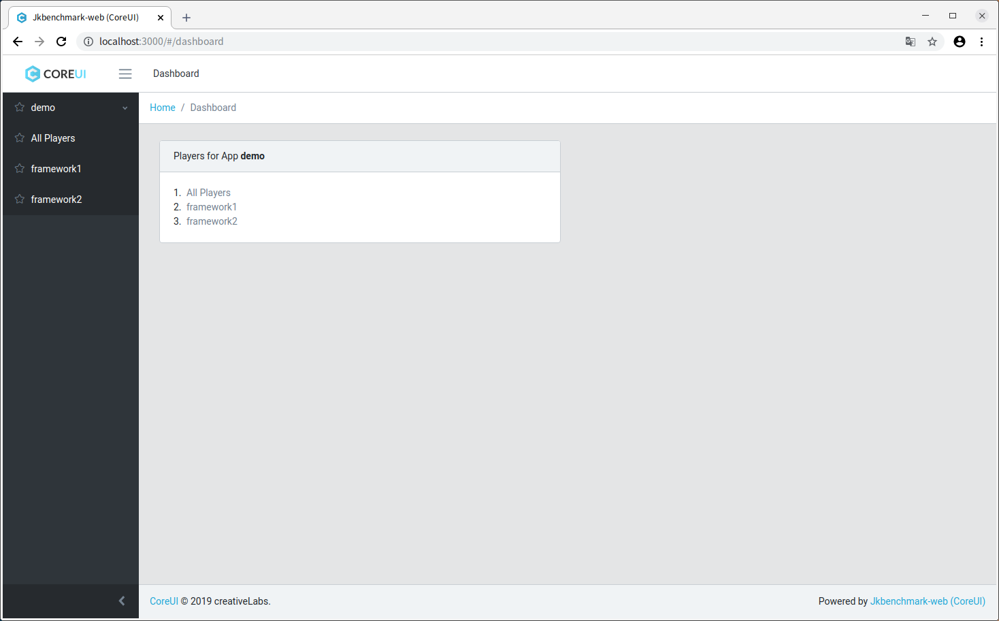
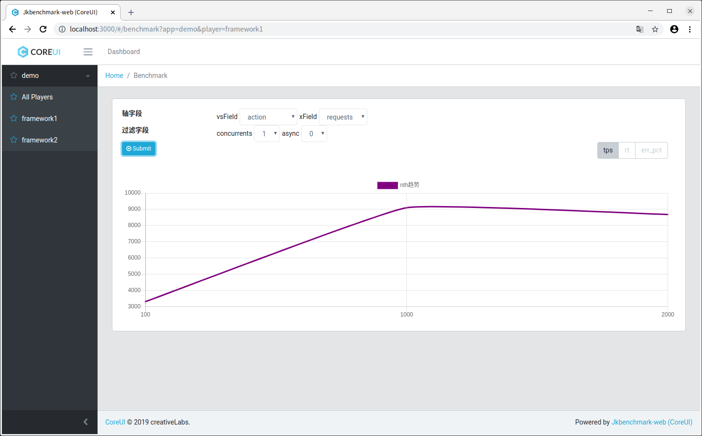

# Jkbenchmark
性能测试框架, 提供类库帮助你开发性能测试代码, 提供web图表帮助你分析性能结果

主要有2个模块
1. jkbenchmark-test, 辅助开发性能测试代码
2. jkbenchmark-web, 图表化显示性能测试结果

# 使用 jkbenchmark-test 开发性能测试代码

## 概念
1. app -- 应用, 表示某个方面的性能测试.

2. player -- 玩家, 表示性能测试的参与方, 可能是多个技术, 如你要对市面上的多个rpc技术进行性能测试, 则每个rpc技术就是一个玩家

3. action -- 动作, 表示要测试的某个行为, 参与测试的多个player都是实现该行为

4. concurrents -- 并发数

5. requests -- 请求数

6. async -- 是否异步

## 添加依赖
1. gradle
```
compile "net.jkcode:jkbenchmark-test:1.9.0"
```

2. maven
```
<dependency>
    <groupId>net.jkcode</groupId>
    <artifactId>jkbenchmark-test</artifactId>
    <version>1.9.0</version>
</dependency>
```

## 开发 Player

```
import net.jkcode.jkbenchmark.BenchmarkApp
import net.jkcode.jkbenchmark.IBenchmarkPlayer
import net.jkcode.jkutil.common.randomInt

/**
 * 运行命令：
 * 　　　java net.jkcode.jkbenchmark.BenchmarkApp net.jkcode.jkbenchmark.tests.DemoPlayer
 */
class DemoPlayer: IBenchmarkPlayer{

    /**
     * 玩家名
     */
    override val name: String = "shi"

    /**
     * 获得同步动作
     */
    override fun getSyncAction(action: String): (Int) -> Any? {
        return when(action){
            "nth" -> this::doNothing
            else -> throw Exception("不能识别action配置: " + action)
        }
    }

    public fun doNothing(i: Int){
        if(randomInt(5) == 0)
            throw Exception("随机错误")
    }

}
```

## 运行player的性能测试

命令格式:

```
java net.jkcode.jkbenchmark.BenchmarkApp player全类名
```

例子:

```
java net.jkcode.jkbenchmark.BenchmarkApp net.jkcode.jkbenchmark.tests.DemoPlayer
```

# 用 jkbenchmark-web 图表化展示性能测试结果

## docker启动
```
# 拉镜像
docker pull registry.cn-hangzhou.aliyuncs.com/shigebeyond/jkbmweb:1.0
# 建容器
docker run -d --network host --name jkbmweb registry.cn-hangzhou.aliyuncs.com/shigebeyond/jkbmweb:1.0
```

注意：要在本地搭建mysql数据源

## 源码启动

### 开发环境下的启动

1. 启动后端server
直接启动主类 `net.jkcode.jkmvc.server.JettyServerLauncher`

2. 启动前端server

```
cd jkbenchmark-web/src/main/webui
npm start
```

### 生产环境的启动

1. 编译前端代码
```
cd jkbenchmark-web/src/main/webui
# 安装依赖，只需跑一次
npm i
# 编译
npm run build
# 运行
npm start
```

运行报错:`react-scripts: not found`
解决:重新安装依赖`npm i`

安装依赖报错:node-sass编译出错
解决
```
# 重新编译node-sass
npm rebuild node-sass
# 如果安装依赖继续报错，则修改 package.json，去掉node-sass依赖，然后再重新安装依赖
```

2. 编译后端代码

```
gradle build -x test -Pall
```

编译后的war文件在: jkbenchmark-web/build/libs/jkbenchmark-web-1.9.0.war

3. 启动http容器

3.1 你可以将 jkbenchmark-web-1.9.0.war 直接扔到 tomcat 的 webapps 中, 直接启动 tomcat 即可

3.2 你也可以使用我写的内嵌jetty来启动

```
cd jkbenchmark-web/build/libs/
./start-jetty.sh
```

## web界面
开发环境访问 http://localhost:3000/

生产环境访问 http://localhost:8080/

首页



某个app下的所有player


某个app下的单个player



