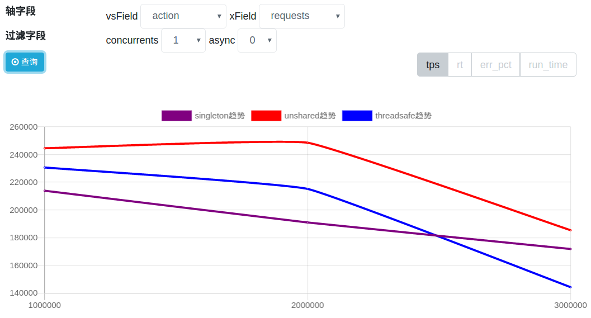
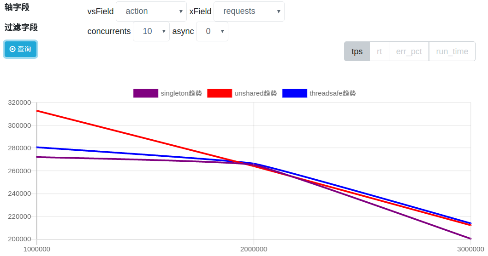
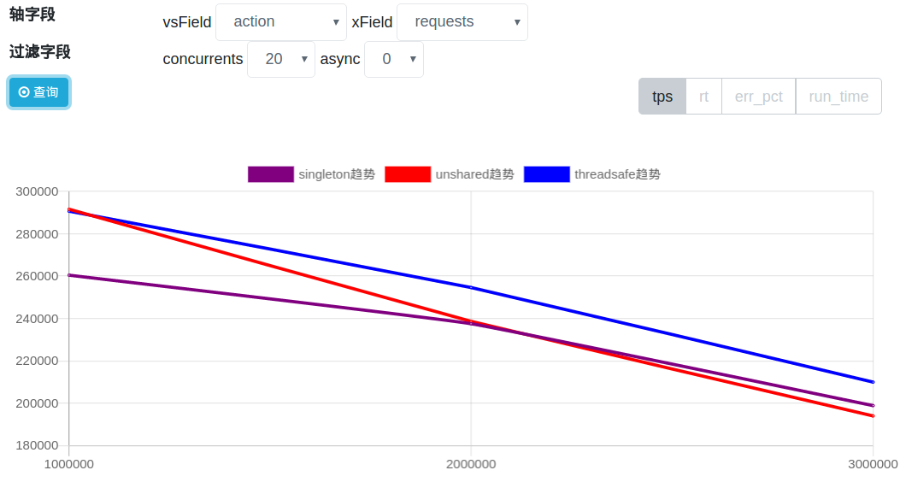
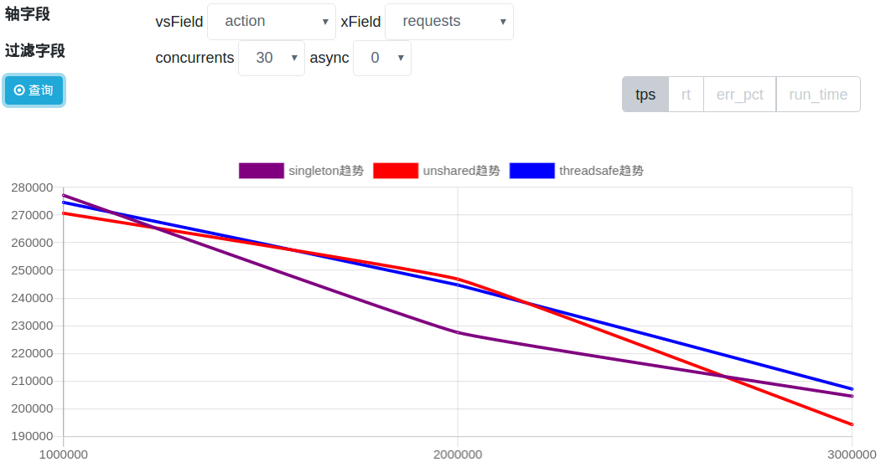

# Serializer Benchmark

序列化框架的性能测试

# 性能测试场景

主要针对的 FSTConfiguration 的不同使用上来进行性能测试, 请求都是百万级别的

serializer-benchmark/src/main/resources/scenes.yaml

```
# 动作
action:
  - singleton # 单例的 FSTConfiguration
  - threadsafe # 线程安全的 FSTConfiguration
  - unshared # 线程安全 + 不共享(不检查循环引用) 的 FSTConfiguration
# 并发数
concurrents:
  - 1
  - 10
  - 20
  - 30
# 请求数
requests:
  - 1000000
  - 2000000
  - 3000000
# 是否异步
async:
  - false # 无异步
```

## 性能测试结果

结果数据见 benchmark_result_data.sql

总体性能: `unshared` > `threadsafe` > `singleton`

`unshared`在10并发以下性能都是最高的, 随着并发增加性能与`threadsafe`趋同

1. 并发为1


2. 并发为10


3. 并发为20


4. 并发为30


